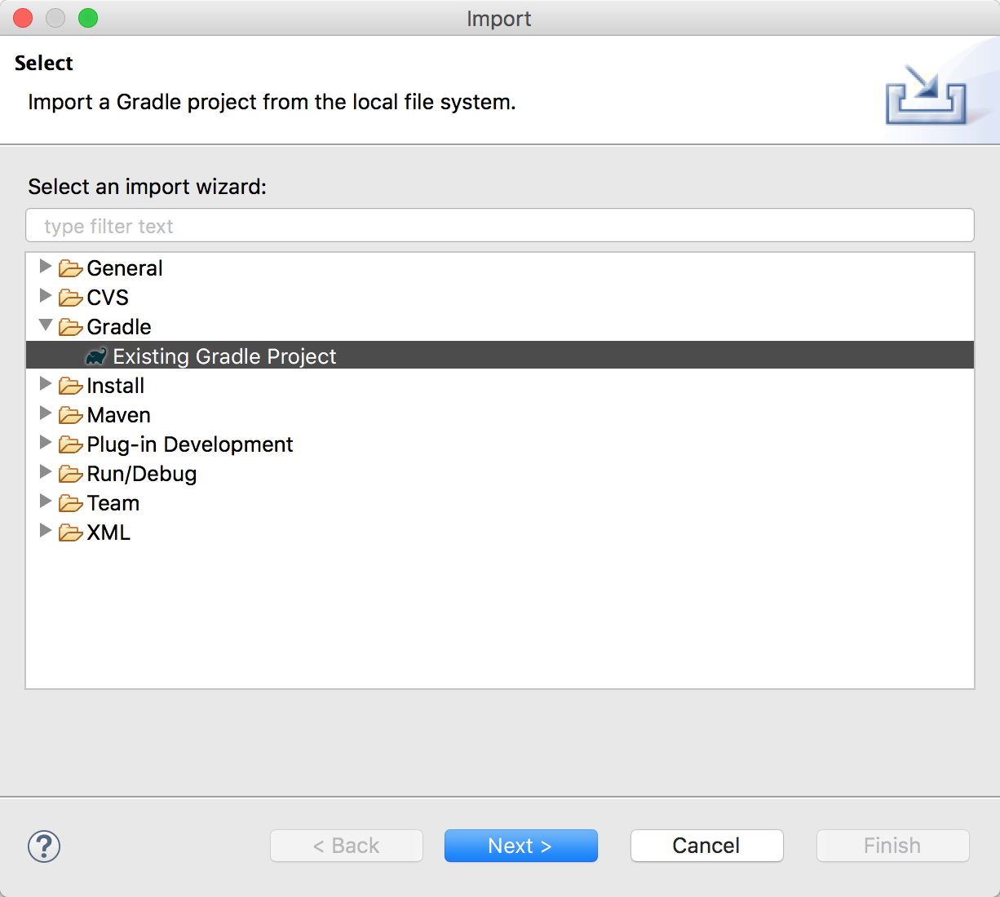
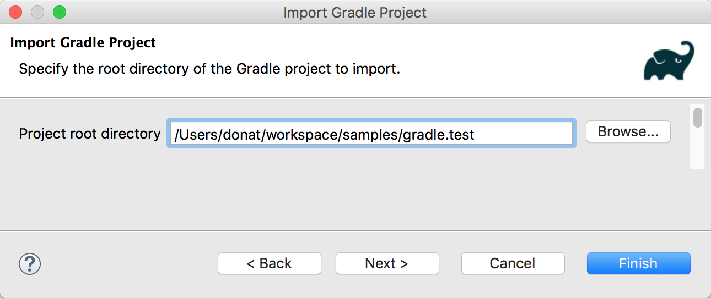
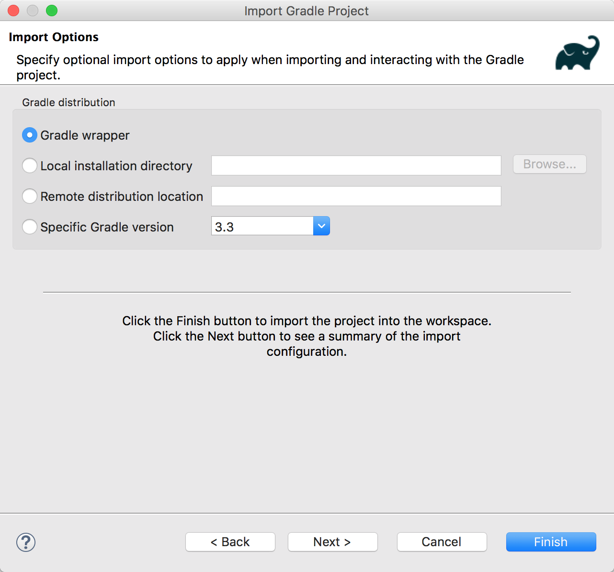
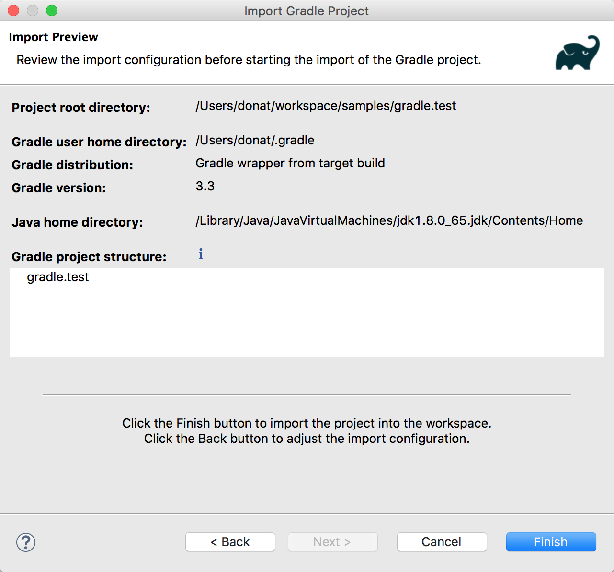
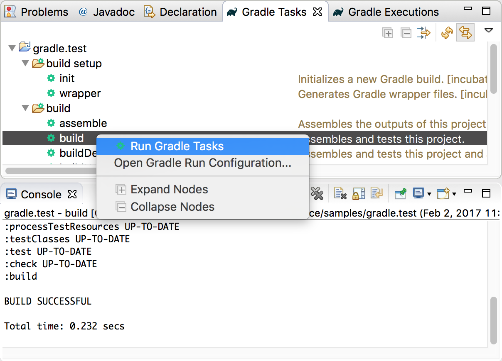
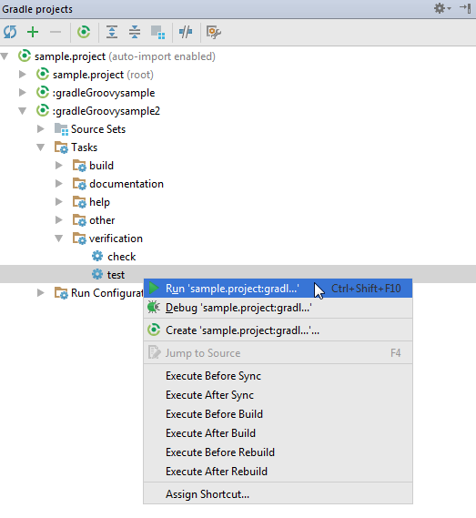

# Agora Signaling Tutorial (JAVA)


This tutorial enables you to quickly get started with using a sample Java chat application to develop requests to the Agora Signaling SDK.

This sample app demonstrates the basic Agora Signaling SDK features:

- Create a peer-to-peer chat (single instance) or a channel chat (multiple instance)
- Create a target account and log in
- Select a chat mode (peer-to-peer private chat or multi-person group chat)
- Find chat by user name (private chat) or channel name (group chat)
- Display private chat history
- Send and receive channel messages
- Leave a chat group
- Logout

## Prerequisites
- Agora.io Developer Account
- Eclipse 4.7.1+ or IntelliJ IDEA 2016+
- Gradle 2.13+

## Quick Start
This section shows you how to prepare and build the Java signaling sample app.

### Create an Account and Obtain an App ID
In order to build and run the sample application you must obtain an App ID: 

1. Create a developer account at [agora.io](https://dashboard.agora.io/signin/). Once you finish the signup process, you will be redirected to the Dashboard.
2. Navigate in the Dashboard tree on the left to **Projects** > **Project List**.
3. Copy the App ID that you obtained from the Dashboard.
4. Open the `src/main/java/tool/Constant.java` file and add your App ID within the class's static declaration using `app_ids.add()`. Ensure `Your_appId` is replaced with the App ID from the Agora dashboard.

	**Note:** To add multiple chat instances, you must add more than one app ID within the static declaration.
	
``` java
public class Constant {
	...
	
	static {
		app_ids.add("Your_appId");
	}
	
	...
}
```

### Import and Run the Sample Application 

1. Download the [Agora Signaling Server SDK for Java] (https://docs.agora.io/en/2.0.2/download)
2. Unzip the downloaded SDK package and copy

	- The `lib` folder into the root folder of the sample application.
	- The `libs-dep/*.jar` packages to the `lib` folder of the sample project.

3. Import the sample application into **Eclipse** or **IntelliJ IDEA** as a gradle project.

	**Eclipse**

	1. Apply the Gradle plugin `eclipse` in the `build.gradle` file:

```
	apply plugin: "eclipse"

```

	2. Run `eclipse` in your project:

```
gradle eclipse
```

	3. Within the Eclipse application, select **File** > **Import...** > **Gradle Project** from the main menu.

		**Note:** When changing anything Eclipse related, rerun `gradle eclipse` to capture the changes.
		
	4. Select **Existing Gradle Project** and click **Next**.

		
		
	5. Enter the directory of the sample application and click **Finish**.

		
		
	6. Click **Finish** to use the default import options.

		
		
	7. Click **Finish** to verify the import settings.

		
		
	8. In the **Gradle Tasks** tab, right-click on the **build** task and select **Run Gradle Tasks**.

		

	**IntelliJ**
	
	1. In **IntelliJ IDEA** select **File** > **Open** from the main menu.
	2. In the dialog that opens, select the directory that contains the sample application and click **OK**.
	3. In the **Gradle projects** tool window.
	4. Right-click the `build` task. From the context menu select **Run**.

		

## Steps to Create the Sample 

The sample application has two main signal Java classes:

- [`SingleSignalObjectMain.java`](src/main/java/mainclass/SingleSignalObjectMain.java) for single instance signaling 
- [`MulteSignalObjectMain2.java`](src/main/java/mainclass/SingleSignalObjectMain.java) for multi-instance signaling.

Both classes implement the `WorkerThread` class, which contains the key code for the sample application. The following code is in the [`WorkerThread.java`](src/main/java/mainclass/WorkerThread.java) file of the sample application.

- [Import Libraries](#import-libraries)
- [Declare the WorkerThread Class](#declare-the-workerthread-class)
- [Declare Global Variables](#declare-global-variables)
- [Create General and Support Methods](#create-general-and-support-methods)
- [Create Signal Methods](#create-signal-methods)
- [Create Login Methods](#create-login-methods)
- [Create User Methods](#create-user-methods)
- [Create Channel Methods](#create-channel-methods)

### Import Libraries

Import the Agora Signal SDK libraries. These libraries provide access to the Agora Signaling SDK.

``` Java
import io.agora.signal.Signal;
import io.agora.signal.Signal.LoginSession;
import io.agora.signal.Signal.LoginSession.Channel;
```

Import the `model` and `tool` classes. The classes are defined in the table below.

Library|File path|Description
---|---|---
`model.DialogueRecord`|[`src/main/java/model/DialogueRecord.java`](src/main/java/model/DialogueRecord.java)|Defines the model for a dialog record. Used to log chat messages.
`model.DialogueStatus`|[`src/main/java/model/DialogueStatus.java`](src/main/java/model/DialogueStatus.java)|Defines constants for the dialog status. Available options are `UNLOGIN`, `LOGINED`, `SINGLE_POINT`, `CHANNEL`, `SIGNALINSTANCE`, `CHOOSESIGNAL`
`tool.Constant`|[`src/main/java/tool/Constant.java`](src/main/java/tool/Constant.java)|Defines global configuration constants for the application such as app ID.
`tool.PrintToScreen`|[`src/main/java/tool/PrintToScreen.java`](src/main/java/tool/PrintToScreen.java)|Class to streamline logging and debugging.

``` Java
import model.DialogueRecord;
import model.DialogueStatus;
import model.User;
import tool.Constant;
import tool.PrintToScreen;
```

Import the Java classes. The classes are defined in the table below.

Class|Description
---|---
`java.io.File`|Representation of file and directory paths.
`java.io.IOException`|Signals occurrence of I/O exceptions.
`java.util.*`|Contains the collections framework, legacy collection classes, event model, date and time facilities, internationalization, and miscellaneous utility classes.
`java.util.concurrent.CountDownLatch`|Synchronization aid allowing threads to wait until completion of other thread operations.
`java.util.concurrent.TimeUnit`|Provides utility methods to convert time units, and perform timing and delay operations.

``` Java
import java.io.File;
import java.io.IOException;
import java.util.*;
import java.util.concurrent.CountDownLatch;
import java.util.concurrent.TimeUnit;
```

### Declare the WorkerThread Class

The `WorkerThread` class contains the main code needed to run the sample application. Both the `SingleSignalObjectMain` and `MulteSignalObjectMain2` classes extend this base class for single and multiple signaling instances.

``` Java
public class WorkerThread implements Runnable {
	...
}
```

The remaining code is declared within this `WorkerThread` class.

### Declare Global Variables

Declare the global variables related to the sample application's status, tokens, and flags.

Variable|Definition
---|---
`mainThreadStatus`|The main thread status. Acts as an indicator for the initialization of the class.
`token`|Token used for login.
`currentUser`|The current user for the session.
`timeOutFlag`|The timeout flag. Acts as an indicator to determine if a process should wait for a previous process to complete.
`currentStatus`|Current status of the application. Acts as an indicator for the applications current running process such as login/logout or signal handling.
`currentMode`|Current mode of the application.

``` Java
    private boolean mainThreadStatus = false;

    private String token = "_no_need_token";
    private String currentUser;
    private boolean timeOutFlag;
    private DialogueStatus currentStatus;
    
    ...

    private String currentMode;    
```

Declare the global variables for users, user messages, and channel lists used in the sample application.

Variable|Definition
---|---
`users`|List of users in the session.
`accountDialogueRecords`|List of user message records.
`channelDialogueRecords`|List of channel message records.
`currentAccountDialogueRecords`|List of current active user accounts.
`currentChannelDialogueRecords`|List of current active channels.


``` Java
    private HashMap<String, User> users;
    private HashMap<String, List<DialogueRecord>> accountDialogueRecords = null;
    private HashMap<String, List<DialogueRecord>> channelDialogueRecords = null;
    List<DialogueRecord> currentAccountDialogueRecords = null;
    List<DialogueRecord> currentChannelDialogueRecords = null;

	...
```

Declare the global variables for parsing and signals.

Variable|Definition
---|---
`in`|`Scanner` object used to parse the application configuration.
`sig`|Current signal for the application.
`currentSignalName`|Current name for the signal.
`signalName`|List of signals.
`signalCount`|Number of signals.
`signalNameAndSignalRecord`|List of signals and associated signal names.
`signalAndUser`|List of signals and associated users.
`isFirstMakeSignal`|Flag to ensure a signal has been created for the application.

```
    private Scanner in;
    private Signal sig;
    
    ...
    
    private String currentSignalName;
    private ArrayList<String> signalName;
    private int signalCount = 0;

    private HashMap<String, Signal> signalNameAndSignalRecord = null;
    private HashMap<Signal, HashMap<String, User>> signalAndUser;
    private boolean isFirstMakeSignal = true;
```

### Create General and Support Methods

The `WorkerThread()` and `init()` methods start the application, while the `run()` method cycles to keep the application active.

- [Create the WorkerThread() Method](#create-the-workerthread()-method)
- [Create the init() Method](#create-the-init()-method)
- [Create the run() Method](#create-the-run()-method)

#### Create the WorkerThread() Method

Create the `WorkerThread` method that will be used to create extensions for this class.

This method sets the `currentMode` for the application, invokes the `init()` method, and sets the `appid`.

- If this is a single signal application, a new signal is created using `new Signal()` and sets the current status to `DialogueStatus.UNLOGIN`.
- If this is a multiple signal application, the current status is set to `DialogueStatus.SIGNALINSTANCE`.

``` Java
    public WorkerThread(String mode) {
        currentMode = mode;
        init();
        String appid = Constant.app_ids.get(0);
        if (currentMode.equals(Constant.COMMAND_SINGLE_SIGNAL_OBJECT)) {
            sig = new Signal(appid);
            currentStatus = DialogueStatus.UNLOGIN;
        } else {
            if (currentMode.equals(Constant.COMMAND_MULTI_SIGNAL_OBJECT)) {
                currentStatus = DialogueStatus.SIGNALINSTANCE;
            }
        }
    }
```

The `SingleSignalObjectMain` and `MulteSignalObjectMain2` classes use the following constants to initialize the application.

Class name|Mode constant
---|---
`SingleSignalObjectMain`|`Constant.COMMAND_SINGLE_SIGNAL_OBJECT`
`MulteSignalObjectMain2`|`Constant.COMMAND_MULTI_SIGNAL_OBJECT`


#### Create the init() Method

The `init()` method is used to set the global variables for the application. After setting the `mainThreadStatus` to `true`, a new `Scanner` object is created.

If the `timeOutFlag` is set to `false`, and the users list is initialized using `new HashMap<String, User>()`.

If the current mode is `Constant.COMMAND_MULTI_SIGNAL_OBJECT`, the following global variables are initialized

- The `signalName` using new `ArrayList<String>()`.
- The `signalNameAndSignalRecord` using `new HashMap<String, Signal>()`.
- The `signalAndUser` using `new HashMap<Signal, HashMap<String, User>>()`.

Complete the method by initializing `accountDialogueRecords` and `channelDialogueRecords` using `new HashMap<String, List<DialogueRecord>>()`.

``` Java
    private void init() {
        this.mainThreadStatus = true;
        in = new Scanner(System.in);

        timeOutFlag = false;
        users = new HashMap<String, User>();

        if (currentMode == Constant.COMMAND_MULTI_SIGNAL_OBJECT) {//add by
            signalName = new ArrayList<String>();
            signalNameAndSignalRecord = new HashMap<String, Signal>();
            signalAndUser = new HashMap<Signal, HashMap<String, User>>();
        }
        accountDialogueRecords = new HashMap<String, List<DialogueRecord>>();
        channelDialogueRecords = new HashMap<String, List<DialogueRecord>>();
    }
```

#### Create the run() Method

The `run()` method handles multi-threading. It contains code for displaying information and prompts to the user using `PrintToScreen.printToScreenLine()` and continues to loops while the `mainThreadStatus` is `true`. The table below outlines how the application switches thread processes based on the sample application's `currentStatus`.

Current Status|Method Invoked
---|---
`SIGNALINSTANCE`|`dealWithProduceSignalInstance()`
`CHOOSESIGNAL`|`dealWithChooseSignalObject()`
`UNLOGIN`|`dealWithUnLogin()`
`LOGINED`|`dealWithLogined()`
`SINGLE_POINT`|`dealWithPersonToPerson()`
`CHANNEL`|`dealWithChannel()`
                    
``` Java
    public void run() {
        PrintToScreen.printToScreenLine("**************************************************");
        PrintToScreen.printToScreenLine("* Agora Signaling Tutorial  ---SDK version:1.2.0 *");
        PrintToScreen.printToScreenLine("**************************************************");
        while (this.mainThreadStatus) {
            switch (currentStatus) {
                case SIGNALINSTANCE:
                    dealWithProduceSignalInstance();
                    break;
                case CHOOSESIGNAL:
                    dealWithChooseSignalObject();
                    break;
                case UNLOGIN:
                    dealWithUnLogin();
                    break;
                case LOGINED:
                    dealWithLogined();
                    break;
                case SINGLE_POINT:
                    dealWithPersonToPerson();
                    break;
                case CHANNEL:
                    dealWithChannel();
                    break;
                default:
                    PrintToScreen.printToScreenLine("*************programe in error states***************");
                    break;
            }
        }
    }
```

### Create Signal Methods

The methods in this section handle methods relating to the `Signal` object.

- [Create the dealWithProduceSignalInstance() and printSignalName() Methods](#create-the-dealwithproducesignalinstance()-and-printsignalname()-methods)
- [Create the printSignalName() Method](#create-the-printsignalname()-method)
- [Create the makeSignals() Method](#create-the-makesignals()-method)
- [Create the chooseWhatToDo() Method](#create-the-choosewhattodo()-method)
- [Create the printAllSignalObject() Method](#create-the-printallsignalobject()-method)
- [Create the dealWithChooseSignalObject() Method](#create-the-dealwithchoosesignalobject()-method)
- [Create the checkTheNumberofSignalObject() Method](#create-the-checkthenumberofsignalobject()-method)


#### Create the dealWithProduceSignalInstance() and printSignalName() Methods

The `dealWithProduceSignalInstance()` method displays the current signal name using `printSignalName()` and and invokes the `makeSignals()` method.

``` Java
    //add by
    public void dealWithProduceSignalInstance() {
        printSignalName(currentSignalName);
        makeSignals();
    }
```

The `printSignalName()` method displays command prompt instructions for the user.

- If the `signalName` is `null` and no signal has been created yet, display a prompt to create a `Signal` object. 
- If the `signalName` is not `null`, display the signal name.

``` Java
    public void printSignalName(String signalName) {

        if (signalName == null) {
            if (isFirstMakeSignal) {
                PrintToScreen.printToScreenLine("************************************************************************");
                PrintToScreen.printToScreenLine("*Your Signal Object  is empty,please create a Signal Object first !*");
                PrintToScreen.printToScreenLine("*You can input '0' to make a Signal Object!                           *");
                PrintToScreen.printToScreenLine("************************************************************************");
            }
        } else {
            PrintToScreen.printToScreenLine("Your signal Object is " + signalName + " .");
        }
    }
```

#### Create the makeSignals() Method

The `makeSignals()` method initializes the local variables `inputSignalCommand` and `needBreak`, which are used within the loop to check for changes in `currentStatus`. The `chooseWhatToDo()` method invokes after the `while` loop completes.

``` Java
    public void makeSignals() {
        String inputSignalCommand = "";
        boolean needBreak = true;
        while ((currentStatus == DialogueStatus.SIGNALINSTANCE) && needBreak) {
        
        		...
        
        }
        chooseWhatToDo();
    }
```

The remaining code in this section occurs within the `while` loop.

- [Verify Signal Creation Status](#verify-signal-creation-status)
- [Initiate the Create Signal Process](#initiate-the-create-signal-process)
- [Create the App ID List](#create-the-app-id-list)
- [Create the Signal](#create-the-signal)


##### Verify Signal Creation Status

If a `isFirstMakeSignal` is `false`, display a prompt to create the `Signal` object. Otherwise, set `isFirstMakeSignal` to `false`.

``` Java

            if (!isFirstMakeSignal) {
                PrintToScreen.printToScreenLine("***********************************************");
                PrintToScreen.printToScreenLine("*You can input '0' to create a Signal Object!*");
                PrintToScreen.printToScreenLine("***********************************************");
            } else {
                isFirstMakeSignal = false;
            }
```

##### Initiate the Create Signal Process

Read the next command using `in.nextLine()`. If `inputSignalCommand` is not equal to `Constant.COMMAND_CREATE_SIGNAL` display an error message.

The remaining code in this section occurs if the `inputSignalCommand` is equal to `Constant.COMMAND_CREATE_SIGNAL`, to create a signal process.

``` Java
            PrintToScreen.printToScreen("Command: ");
            inputSignalCommand = in.nextLine() + "";
            if (!inputSignalCommand.equals(Constant.COMMAND_CREATE_SIGNAL)) {
                PrintToScreen.printToScreenLine("");
                PrintToScreen.printToScreenLine("***************************************************");
                PrintToScreen.printToScreenLine("*Can't understand your command, Please Try again! *");
                PrintToScreen.printToScreenLine("***************************************************");

            } else {
            		...
            }
```

##### Create the App ID List

Initialize the local variable `appId` to `null` and `appIdneedBreak` to `true`.

While the current status is `DialogueStatus.SIGNALINSTANCE` and `appIdneedBreak` is `true`, check the size of `app_ids`.

- If the current app ID is less than the `app_ids` size, increment the current app ID using `Constant.CURRENT_APPID++` and set `appIdneedBreak` to `false`.
- If the current app ID is greater than the `app_ids` size:
	- Display a message indicating there are no more app IDs to process
	- Retrieve the next appID using `in.nextLine()`
	- If the `appId` is empty, display the app ID's status
	- If the `appId` is not empty, append the app ID to the `app_ids`, increment the `CURRENT_APPID` and set `appIdneedBreak` to `false`.

``` Java
                String appId = null;
                boolean appIdneedBreak = true;

                while ((currentStatus == DialogueStatus.SIGNALINSTANCE) && appIdneedBreak) {
                    if (Constant.CURRENT_APPID < Constant.app_ids.size()) {
                        appId = Constant.app_ids.get(Constant.CURRENT_APPID);
                        Constant.CURRENT_APPID++;
                        appIdneedBreak = false;
                    } else {
                        PrintToScreen.printToScreenLine("There are no more appId,please input a new appId :");
                        PrintToScreen.printToScreen("APPID: ");
                        appId = in.nextLine();
                        if (appId.equals("") | appId.equals(null)) {
                            PrintToScreen.printToScreenLine("***************************************************");
                            PrintToScreen.printToScreenLine("Sorry,your appId is null!");
                            PrintToScreen.printToScreenLine("***************************************************");

                        } else {
                            Constant.app_ids.add(appId);
                            Constant.CURRENT_APPID++;
                            appIdneedBreak = false;
                        }
                    }
                }
```

##### Create the Signal

This section of code creates a new `Signal` using the `appId` and appends it to the signal lists.

- Create a new `Signal` object using `new Signal()` and display the app ID using `PrintToScreen.printToScreenLine()`.
- Set the `currentSignalName` and add it to the signal name list using `signalName.add()`.
- Append a new signal key-value pair for `currentSignalName` and `signal` using `signalNameAndSignalRecord.put()`.
- Increment the signal count using `signalCount++`.
- Display the `currentSignalName` and the list of signal objects for the application using and `PrintToScreen.printToScreenLine()` and `printAllSignalObject()`.
- Set `needBreak` to `false`.

``` Java
                Signal signal = new Signal(appId);
                PrintToScreen.printToScreenLine("Current Signal Object appId = " + appId);
                currentSignalName = "Signal " + signalCount;
                signalName.add(currentSignalName);
                signalNameAndSignalRecord.put(currentSignalName, signal);
                signalCount++;
                PrintToScreen.printToScreenLine("**************************************************");
                PrintToScreen.printToScreenLine("                    Success !                     ");
                PrintToScreen.printToScreenLine("Current Signal Object is " + currentSignalName + ".             ");
                PrintToScreen.printToScreenLine("Here are all Signal Objects:                     ");
                PrintToScreen.printToScreenLine(printAllSignalObject());
                PrintToScreen.printToScreenLine("**************************************************");

                needBreak = false;
```

#### Create the chooseWhatToDo() Method

The `chooseWhatToDo()` method provides options for the user to create a signal or create an accountCreate the login() Method.

Initialize `needBreak` to `true`. While the `currentStatus` is a signal instance and `needBreak` remains `true`, output the input command options `0` and `1`.

- `0` will create a new `Signal` object using `makeSignals()`.
- `1` will create a new account for the `Signal` object setting `currentStatus` to `DialogueStatus.UNLOGIN`.


``` Java
    public void chooseWhatToDo() {
        boolean needBreak = true;
        while ((currentStatus == DialogueStatus.SIGNALINSTANCE) && needBreak) {
            String inputCommand = "";
            PrintToScreen.printToScreenLine("Please choose what to do...");
            PrintToScreen.printToScreenLine("**************************************************************");
            PrintToScreen.printToScreenLine("*input '0' choose to create a Signal Objcet continue!        *");
            PrintToScreen.printToScreenLine("*input '1' chooose to create an Account in this Signal Object*");
            PrintToScreen.printToScreenLine("**************************************************************");
            PrintToScreen.printToScreen("Command: ");
            inputCommand = in.nextLine();
            if (inputCommand.equals(Constant.COMMAND_CREATE_SIGNAL)) {
                makeSignals();
                needBreak = false;
            } else if (inputCommand.equals(Constant.COMMAND_CREATE_ACCOUNT)) {
                currentStatus = DialogueStatus.UNLOGIN;
                needBreak = false;
            } else {
                PrintToScreen.printToScreenLine("*********************************************");
                PrintToScreen.printToScreenLine("...your command: " + inputCommand + "  can't understand...");
                PrintToScreen.printToScreenLine("*********************************************");
            }
        }
    }
```

#### Create the printAllSignalObject() Method

The `printAllSignalObject()` method displays all the `Signal` objects for the application.

- Create a new `StringBuilder` which will contain the full list of signals. 
- Loop through `signalName` and append each signal to `stringBuilder`
- When the loop is complete, return the resulting string using `stringBuilder.toString()`

``` Java
    private String printAllSignalObject() {
        StringBuilder stringBuilder = new StringBuilder();
        for (int i = 0; i < signalName.size(); i++) {
            if (i != (signalName.size() - 1)) {
                stringBuilder.append(i + 1 + ":  ").append(signalName.get(i)).append("\n");
                continue;
            }
            stringBuilder.append(signalName.size() + ":  ").append(signalName.get(i));
        }

        return stringBuilder.toString();
    }
```

#### Create the dealWithChooseSignalObject() Method

The `dealWithChooseSignalObject()` method displays the current signal name and lists all the signal objects from `printAllSignalObject()`.

Add a prompt to allow the current signal to be changed. The command invokes the `checkTheNumberofSignalObject()` method.

``` Java
    private void dealWithChooseSignalObject() {
        PrintToScreen.printToScreenLine("**************************************************************");
        PrintToScreen.printToScreenLine("Current Signal Object is " + currentSignalName + ".              ");
        PrintToScreen.printToScreenLine("Here are all Signal Objects:                     ");
        PrintToScreen.printToScreenLine(printAllSignalObject());
        String allSignalObject = printAllSignalObject();
        PrintToScreen.printToScreenLine("You can switch Signal Object by input the number of the Signal.... ");
        PrintToScreen.printToScreen("Command: ");

        String inputCommand = in.nextLine();
        checkTheNumberofSignalObject(inputCommand);

    }
```

#### Create the checkTheNumberofSignalObject() Method

The `checkTheNumberofSignalObject()` method sets `currentSignalName` to the signal object `numberSignalObject` and sets the `currentStatus` to `DialogueStatus.UNLOGIN`.

If the signal object is not found within `signalName`, display an error prompt and invoke the `dealWithChooseSignalObject()` method.

``` Java
    private void checkTheNumberofSignalObject(String numberSignalObject) {
        for (int i = 0; i < signalName.size(); i++) {
            if (numberSignalObject.equals(i + 1 + "")) {

                currentSignalName = signalName.get(i);
                PrintToScreen.printToScreenLine("**************************************************************");

                PrintToScreen.printToScreenLine("Current Signal Object is " + currentSignalName);
                currentStatus = DialogueStatus.UNLOGIN;

                return;
            }
        }
        PrintToScreen.printToScreenLine("...your command: " + numberSignalObject + "  can't understand...");
        dealWithChooseSignalObject();
    }
```

### Create Login Methods

The methods in this section manage user login and logout functionality.

- [Create the dealWithUnLogin() Method](#create-the-dealwithunlogin()-method)
- [Create the checkWheatherSwitchSignalObject() Method](#create-the-checkwheatherswitchsignalobject()-method)
- [Create the dealWithLogined() Method](#create-the-dealwithlogined()-method)
- [Create the login() Method](#create-the-login()-method)
- [Create the wait_time() Method](#create-the-wait_time()-method)

#### Create the dealWithUnLogin() Method

The `dealWithUnLogin()` method handles the logout functionality for the application. The method continues to loop through the following actions while the `mainThreadStatus` is `true` and the `currentStatus` is equal to `DialogueStatus.UNLOGIN`.

- [Initialize Local Variables](#initialize-local-variables)
- [Handle Multi Signal Mode](#handle-multi-signal-mode)
- [Handle Single Signal Mode](#handle-single-signal-mode)
- [Handle Login](#handle-login)


##### Initialize Local Variables

An empty string `inputCommand` is initialized and a new signal `currentSignal` is initialized to `null`. These local variables will be used to process the login for both multi signal mode `Constant.COMMAND_MULTI_SIGNAL_OBJECT` and single signal mode `Constant.COMMAND_SINGLE_SIGNAL_OBJECT`.

``` Java
    public void dealWithUnLogin() {
        while (this.mainThreadStatus && (this.currentStatus == DialogueStatus.UNLOGIN)) {

            String inputCommand = "";
            Signal currentSignal = null;

            if (currentMode.equals(Constant.COMMAND_MULTI_SIGNAL_OBJECT)) {
        
	        		...
	        		
            } else if (currentMode.equals(Constant.COMMAND_SINGLE_SIGNAL_OBJECT)) {
            
            		...
            
            }
            
            ...
        		
        }
    }
```

##### Handle Multi Signal Mode

If the `currentMode` is in signal mode, display the current signal name and prompt the user to login.

Set the `inputCommand` and verify if the signal object needs to be changed using `checkWheatherSwitchSignalObject`.

Set the `currentSignal` to the current signal, by retrieving it from `signalNameAndSignalRecord`.

``` Java                PrintToScreen.printToScreenLine("**************************************************************");
                PrintToScreen.printToScreenLine("Current Signal is :" + currentSignalName + "    " + signalNameAndSignalRecord.get(currentSignalName).toString());
                PrintToScreen.printToScreenLine("You can input 'switch' to choose a Signal Object....");
                PrintToScreen.printToScreenLine("Please enter your account to login....");
                PrintToScreen.printToScreenLine("**************************************************************");
                PrintToScreen.printToScreen("Account:");
                inputCommand = in.nextLine();
                checkWheatherSwitchSignalObject(inputCommand);
                currentSignal = signalNameAndSignalRecord.get(currentSignalName);
```

##### Handle Single Signal Mode

If the `currentMode` is single signal mode, display the current signal name and prompt the user to login.

Set the `inputCommand` and set the `currentSignal` to `sig`.

``` Java
                PrintToScreen.printToScreenLine("Current Signal is  :" + sig.toString());
                PrintToScreen.printToScreen("Account:");
                inputCommand = in.nextLine();
                currentSignal = sig;
```

##### Handle Login

To handle login, verify the `currentStatus` does not equal `DialogueStatus.UNLOGIN`.

The `inputCommand` is verified using `checkAccountName()` and the login process is invoked using `login()`, passing in `inputCommand` and `currentSignal`.

If the `inputCommand` is not valid, a prompt to the user is sent explaining that the user's login information is incorrect.

``` Java

            if (currentStatus != DialogueStatus.UNLOGIN) {
                return;
            }

            if (checkAccountName(inputCommand)) {
                login(inputCommand, currentSignal);
            } else {
                PrintToScreen.printToScreenLine("Please recheck the account,it has format error");
                PrintToScreen.printToScreenLine("********************************************************");
            }
```

#### Create the checkWheatherSwitchSignalObject() Method

The `checkWheatherSwitchSignalObject()` method checks that the `inputCommand` is equal to `switch` and sets the `currentStatus` to `DialogueStatus.CHOOSESIGNAL`.

``` Java
    private void checkWheatherSwitchSignalObject(String inputCommand) {
        if (inputCommand.equals("switch")) {
            currentStatus = DialogueStatus.CHOOSESIGNAL;
        }
    }
```

#### Create the dealWithLogined() Method

The `dealWithLogined()` method continues to loop while the `mainThreadStatus` is `true` and the `currentStatus` is equal to `DialogueStatus.LOGINED`.

Initialize the local variable `loginedFlag` and set it to `true`. This is used to verify if command processing.

``` Java
    public void dealWithLogined() {
        while (this.mainThreadStatus && this.currentStatus == DialogueStatus.LOGINED) {
        
            boolean loginedFlag = true;
            
            ...
            
        }
    }
```

- [Display Command Prompts](#display-command-prompts)
- [Process Commands](#process-commands)
- [Logout Command](#logout-command)
- [Single Point and Channel Commands](#single-point-and-channel-commands)


##### Display Command Prompts

While `mainThreadStatus` and `loginedFlag` is `true`, display command prompts for the user to choose one of the following options:

Command|Result
---|---
`Constant.COMMAND_LOGOUT`|Start the logout process
`2`| Display a single point chart
`3`| Display a channel chart

Once the user chooses a `command`, the remaining code will process the command.

``` Java
            while (this.mainThreadStatus && loginedFlag) {
                PrintToScreen.printToScreenLine("******************************************************");
                PrintToScreen.printToScreenLine("you can input '" + Constant.COMMAND_LOGOUT + "' to logout....");
                PrintToScreen.printToScreenLine("Please chose chart type.....");
                PrintToScreen.printToScreenLine("****************************************************");
                PrintToScreen.printToScreenLine("*input '2' choose single_point chart               *");
                PrintToScreen.printToScreenLine("*input '3' choose channel chart                    *");
                PrintToScreen.printToScreenLine("****************************************************");
                PrintToScreen.printToScreen("choose option:");
                String command = in.nextLine();
                
                ...
                
            }
```

##### Process Commands

The `loginedFlag` is set to `false` for all commands, unless the command is not found. If the command is not found, an error prompt is displayed.

``` Java
                if (command.equals(Constant.COMMAND_LOGOUT)) {
                    loginedFlag = false;
                
                		...
                		
                } else if (command.equals(Constant.COMMAND_TYPE_SINGLE_POINT)) {
                    loginedFlag = false;
                
                		...
                
                } else if (command.equals(Constant.COMMAND_TYPE_CHANNEL)) {
                    loginedFlag = false;
                    
                    ...
                    
                } else {
                    PrintToScreen.printToScreenLine("************************************************");
                    PrintToScreen.printToScreenLine("...your command:" + command + " can't understand...");
                }
```

##### Logout Command

If the command is `Constant.COMMAND_LOGOUT`, the `users` list and `currentUser` are verified before invoking the `logout()` process.

The `timeOutFlag` set to `false` and the `wait_time()` method is invoked.

If the `users` list or `currentUser` are `null`, the user is already logged out, so the `currentStatus` is set to `DialogueStatus.UNLOGIN`.

``` Java
                    loginedFlag = false;
                    if ((users != null) && (currentUser != null)) {
                        users.get(currentUser).getSession().logout();
                        timeOutFlag = false;
                        wait_time(users.get(currentUser).getLogoutLatch(), Constant.TIMEOUT, currentUser);
                    } else {

                        currentStatus = DialogueStatus.UNLOGIN;
                    }
```

##### Single Point and Channel Commands

If the command is a single point command or channel command, set the `currentStatus` to the following:

Command|`currentStatus` Value
---|---
`Constant.COMMAND_TYPE_SINGLE_POINT`|`DialogueStatus.SINGLE_POINT`
`Constant.COMMAND_TYPE_CHANNEL`|`DialogueStatus.CHANNEL`

``` Java
                } else if (command.equals(Constant.COMMAND_TYPE_SINGLE_POINT)) {
                    loginedFlag = false;
                    currentStatus = DialogueStatus.SINGLE_POINT;
                } else if (command.equals(Constant.COMMAND_TYPE_CHANNEL)) {
                    loginedFlag = false;
                    currentStatus = DialogueStatus.CHANNEL;
```


#### Create the login() Method

The `login()` method processes the user's `accountName` for the specified `signal`.

A command prompt displays the signal, account name, and token and a new `CountDownLatch` object is created.

The login process for the signal is invoked using `sig.login()`.

The login method completes by setting `timeOutFlag` to `false` and invoking the `wait_time()` method.

``` Java
    public void login(final String accountName, Signal signal) {

        sig = signal;
        PrintToScreen.printToScreenLine("Signal is a :  = " + sig + "   accountName  = " + accountName + "   token   = " + token);

        final CountDownLatch loginLatch = new CountDownLatch(1);


        sig.login(accountName, this.token, new Signal.LoginCallback() {
        
        		...
        		
        });
        this.timeOutFlag = false;
        wait_time(loginLatch, Constant.TIMEOUT, accountName);
    }
```

The remaining code in this section are the callback functions for the `sig.login()` method.

- [Successful Login Callback](#successful-login-callback)
- [Failed Login Callback](#failed-login-callback)
- [Logout Callback](#logout-callback)
- [Instant Message Received Callback](instant-message-received-callback)

##### Successful Login Callback

The `onLoginSuccess()` callback method verifies the `timeOutFlag` is `false` before updating the application settings.

If `timeOutFlag` is `false`, the `currentUser` is set to `accountName` and a new `User` object is created for the `session`.

The `user.setLoginLatch()` method is invoked and the `currentUser` is added to the `users` list.

Display the successful login confirmation, set the `currentStatus` to `DialogueStatus.LOGINED` and invoke the `user.getLoginLatch().countDown()` method.

``` Java
            @Override
            public void onLoginSuccess(final Signal.LoginSession session, int uid) {
                if (timeOutFlag == false) {
                    currentUser = accountName;
                    User user = new User(session, accountName, uid);

                    user.setLoginLatch(loginLatch);
                    users.put(currentUser, new User(session, accountName, uid));
                    PrintToScreen.printToScreenLine("account:" + users.get(accountName).getAccount() + " login successd");
                    currentStatus = DialogueStatus.LOGINED;
                    user.getLoginLatch().countDown();
                }
            }
```

##### Failed Login Callback

The `onLoginFailed()` method invokes the `onLoginFailed()` method of the superclass and displays a login failed error message to the user.

``` Java
            /*@Override
            public void onLoginFailed(LoginSession session, int ecode) {
            	// TODO Auto-generated method stub
            	super.onLoginFailed(session, ecode);
            PrintToScreen.printToScreenLine("account:"+users.get(accountName).getAccount()+" login failed");     	
           
            }*/
```

##### Logout Callback

The `onLogout()` callback verifies if the user is logged in and if the `timeOutFlag` is `false` before updating the application lists.

If verified, a logout success message is displayed and the account message and channel message lists are emptied using `accountDialogueRecords.clear()` and `currentChannelDialogueRecords.clear()`.

Complete the method by setting the `currentStatus` to `DialogueStatus.UNLOGIN`, invoking the `countDown()` method, and setting the `currentUser` to `null`.

``` Java
            @Override
            public void onLogout(Signal.LoginSession session, int ecode) {
                if (currentStatus == DialogueStatus.LOGINED && timeOutFlag == false) {
                    PrintToScreen.printToScreenLine("account:" + users.get(accountName).getAccount() + " logout successd");
                    if (accountDialogueRecords != null) {
                        accountDialogueRecords.clear();
                    }
                    if (currentChannelDialogueRecords != null) {
                        currentChannelDialogueRecords.clear();
                    }
                    currentStatus = DialogueStatus.UNLOGIN;
                    users.get(currentUser).getLogoutLatch().countDown();
                    currentUser = null;
                }
            }
```

##### Instant Message Received Callback

The `onMessageInstantReceive()` method verifies the current account message lists is not `null` and the `currentStatus` is `DialogueStatus.SINGLE_POINT` before creating a new message.

If verified, display the account message, create a new `DialogueRecord` for the `account` and adds it to `currentAccountDialogueRecords`.

``` Java
            @Override
            public void onMessageInstantReceive(Signal.LoginSession session, String account, int uid, String msg) {
                if (currentAccountDialogueRecords != null && currentStatus == DialogueStatus.SINGLE_POINT) {
                    PrintToScreen.printToScreenLine(account + ":" + msg);
                    DialogueRecord dialogueRecord = new DialogueRecord(account, msg, new Date());
                    currentAccountDialogueRecords.add(dialogueRecord);
                }
            }
```


#### Create the wait_time() Method

The `wait_time()` method is used to manage login timeouts. If the `x.await()` timeout method is interrupted, set the `currentStatus` to `DialogueStatus.UNLOGIN`.

If `x.getCount()` is equal to `1`:

- Set the `timeOutFlag` to `true`
- Display a timeout message to the user
- Set `currentStatus` to `DialogueStatus.UNLOGIN`
- Logout the user using the `logout()` method

``` Java
    public void wait_time(CountDownLatch x, int tInMS, String accountName) {
        try {
            x.await(tInMS, TimeUnit.MILLISECONDS);
        } catch (InterruptedException e) {
            currentStatus = DialogueStatus.UNLOGIN;
        }
        if (x.getCount() == 1) {
            this.timeOutFlag = true;
            PrintToScreen.printToScreenLine("connect time out ......");
            currentStatus = DialogueStatus.UNLOGIN;
            if (users.get(accountName) != null) {
                users.get(accountName).getSession().logout();
            }
        }
    }
```


### Create User Methods

The methods in this section handle communication between users.

- [Create the dealWithPersonToPerson() Method](#create-the-dealwithpersontoperson()-method)
- [Create the queryUserStatus() Method](#create-the-queryuserstatus()-method)
- [Create the intoP2PConversation() Method](#create-the-intop2pconversation-method)
- [Create the initP2PRecord List and checkAccountName() Method](#create-the-initp2precord-list-and-checkaccountname()-method)


#### Create the dealWithPersonToPerson() Method

The `dealWithPersonToPerson()` method selects the user the current user wants to communicate with. The method loops while the `mainThreadStatus` is `true` and `currentStatus` is a single point communication `DialogueStatus.SINGLE_POINT `.

If the `mainThreadStatus` and `currentStatus` are validated, display the prompt for the user to communicate with and verify the other user using `checkAccountName()`.

If the other user is verified, invoke the `intoP2PConversation()` method, otherwise display a "user not found" error message.

``` Java
    public void dealWithPersonToPerson() {
        while (this.mainThreadStatus && this.currentStatus == DialogueStatus.SINGLE_POINT) {
            PrintToScreen.printToScreenLine("************************************************");
            PrintToScreen.printToScreenLine("Please enter the opposite account.....");
            PrintToScreen.printToScreen("Input Opposite Account:");
            String oppositeAccount = in.nextLine();
            if (checkAccountName(oppositeAccount)) {
                intoP2PConversation(oppositeAccount);
            } else {
                PrintToScreen.printToScreenLine("Please recheck the oppositeAccount,it has format error");
                PrintToScreen.printToScreenLine("**************************************************");
            }
        }
    }
```

#### Create the queryUserStatus() Method

The `queryUserStatus()` method in the sample app is not used, but code can be added to display the user's status using `PrintToScreen.printToScreenLine()`.

``` Java
    public void queryUserStatus(String account) {

    }
```

#### Create the intoP2PConversation() Method

The `intoP2PConversation()` method begins the conversation with the another user.

The method begins by setting `p2pFlag` to `true` and setting `currentAccountDialogueRecords` to the other user's records using `initP2PRecord()`.

``` Java
    public void intoP2PConversation(String oppositeAccount) {
        boolean p2pFlag = true;
        currentAccountDialogueRecords = initP2PRecord(oppositeAccount);        
        
        ...
        
    }        
```

- If there are no current messages in `currentAccountDialogueRecords`, initializes it using `new ArrayList<DialogueRecord>()`.
- If messages exist, loop through the messages and display them to the user.

Display the message count summary.

``` Java        PrintToScreen.printToScreenLine("**************************************************");
        if (currentAccountDialogueRecords == null || currentAccountDialogueRecords.size() == 0) {
            currentAccountDialogueRecords = new ArrayList<DialogueRecord>();
        } else {
            for (int i = 0; i < currentAccountDialogueRecords.size(); i++) {
                PrintToScreen.printToScreenLine(currentAccountDialogueRecords.get(i).getAccount() + ":" + currentAccountDialogueRecords.get(i).getDialogue());
            }
        }
        PrintToScreen.printToScreenLine("****above is history record :" + currentAccountDialogueRecords.size() + "**************");
```

Prompt the user to send a new message or leave the session using `Constant.COMMAND_LEAVE_CHART`.

While the `mainThreadStatus` and `p2pFlag` are both `true`, process the user's commands.

- If the user's `command` is `Constant.COMMAND_LEAVE_CHART`:
	- Set the `p2pFlag` to `false`.
	- Set `currentStatus` to `DialogueStatus.LOGINED`.
	- Add the `currentAccountDialogueRecords` for the `oppositeAccount` to `accountDialogueRecords`.
- If the user is sending a message, use the `sendMsg()` method to send the message to `oppositeAccount`.

``` Java                
        PrintToScreen.printToScreenLine("you can send message now and input '" + Constant.COMMAND_LEAVE_CHART + "' to leave this session");
        PrintToScreen.printToScreenLine("***************" + oppositeAccount + " status : " + "to do " + "******************");
        while (this.mainThreadStatus && p2pFlag) {
            String command = in.nextLine();
            if (command.equals(Constant.COMMAND_LEAVE_CHART)) {
                p2pFlag = false;
                currentStatus = DialogueStatus.LOGINED;
                accountDialogueRecords.put(oppositeAccount, currentAccountDialogueRecords);
            } else {
                sendMsg(command, oppositeAccount);
            }
        }
```

#### Create the initP2PRecord List and checkAccountName() Method

The `initP2PRecord` method returns a list of the messages for the user `oppositeAccount`.

``` Java
    public List<DialogueRecord> initP2PRecord(String oppositeAccount) {
        return accountDialogueRecords.get(oppositeAccount);
    }
```

The `checkAccountName()` method runs verification checks for a user's account.

The method will return `false` if:

- The `accountName` contains a space
- The `accountName` character length is less than or equal to `0` or longer than `128`
- The account name is the same as the current user

If the user's account is verified, set `returnFlag` to `true` and return its value.

``` Java
    public boolean checkAccountName(String accountName) {
        boolean returnFlag = false;
        if (accountName.contains(" ")) {
            return returnFlag;
        } else if (accountName.length() <= 0 || accountName.length() >= 128) {
            return returnFlag;
        } else if (accountName.equals(currentUser)) {
            PrintToScreen.printToScreenLine("...the same as the logining account...");
            return returnFlag;
        }
        returnFlag = true;
        return returnFlag;
    }
```

### Create Channel Methods

- [Create the dealWithChannel() Method](#create-the-dealwithchannel()-method)
- [Create the intoChannelConversation() Method](#create-the-intochannelconversation()-method)
- [Create the channelDeal() Method](#create-the-channeldeal()-method)
- [Create the joinChannel() Method](#create-the-joinchannel()-method)
- [Declare the initChannelRecord List](#declare-the-initchannelrecord-list)
- [Create the sendMsg() Method](#create-the-sendmsg()-method)
- [Create the initRecordFile() Method](#create-the-initrecordfile()-method)


#### Create the dealWithChannel() Method

The `dealWithChannel()` method adds the user to the specified channel.

The method loops while `mainThreadStatus` is `true` and `currentStatus` is equal to `DialogueStatus.CHANNEL`.

Prompt the user to enter the channel name or logout. Validate the channel name using `checkAccountName()`.

- If the channel name is a valid:
	- Verify that the `currentStatus` is equal to `DialogueStatus.CHANNEL` and the timeOutFlag is `false`, in order to and enter the user into the channel using `intoChannelConversation()`
	- Otherwise display a join channel error message

- If the channel is invalid, prompt the user to re-enter the channel name

``` Java
    public void dealWithChannel() {
        while (this.mainThreadStatus && this.currentStatus == DialogueStatus.CHANNEL) {
            PrintToScreen.printToScreenLine("************************************************");
            PrintToScreen.printToScreenLine("you can input '" + Constant.COMMAND_LOGOUT + "' to logout....");
            PrintToScreen.printToScreenLine("Please enter the channel name.....");
            PrintToScreen.printToScreen("channel name:");
            String channelName = in.nextLine();
            if (checkAccountName(channelName)) {
                joinChannel(channelName);
                if (this.currentStatus == DialogueStatus.CHANNEL && timeOutFlag == false) {
                    intoChannelConversation(channelName);
                } else {
                    PrintToScreen.printToScreenLine("****************join channel error*************");
                }
            } else {
                PrintToScreen.printToScreenLine("Please recheck the channel name,it has format error");
                PrintToScreen.printToScreenLine("**************************************************");
            }
        }
    }
```

#### Create the intoChannelConversation() Method

The `intoChannelConversation()` method handles sending messages to the channel.

Initialize `channelFlag` to `true` and set `currentChannelDialogueRecords` using `initChannelRecord()` for the `channelName`.

- If `currentChannelDialogueRecords` is `null` or there are no messages in `currentChannelDialogueRecords`, initialize `currentChannelDialogueRecords`.

- Otherwise, print the list of messages for the channel and the summary for the number of messages.

``` Java
    public void intoChannelConversation(String channelName) {
        boolean channelFlag = true;
        currentChannelDialogueRecords = initChannelRecord(channelName);
        PrintToScreen.printToScreenLine("*******************channel:" + channelName + "*****************");
        if (currentChannelDialogueRecords == null || currentChannelDialogueRecords.size() == 0) {
            currentChannelDialogueRecords = new ArrayList<DialogueRecord>();
        } else {
            for (int i = 0; i < currentChannelDialogueRecords.size(); i++) {
                PrintToScreen.printToScreenLine(currentChannelDialogueRecords.get(i).getAccount() + ":" + currentChannelDialogueRecords.get(i).getDialogue());
            }
        }
        PrintToScreen.printToScreenLine("****above is history record :" + currentChannelDialogueRecords.size() + "**************");
        
        ...
        
    }
```

Complete the method's `while` loop by displaying a prompt for the user to send a message to the channel, or leave the session using `Constant.COMMAND_LEAVE_CHART`.

While the `mainThreadStatus` and `channelFlag` is `true`, process the user commands.

If the `command` equals `Constant.COMMAND_LEAVE_CHART`:

- Set the `channelFlag` to `false`.
- Set the `currentStatus` to `DialogueStatus.LOGINED`.
- Invoke the `channelLeave()` method.
- Add the `currentChannelDialogueRecords` list for the channel to `channelDialogueRecords`.

If the command is a channel message, invoke the `channelDeal()` method.

``` Java
        PrintToScreen.printToScreenLine("you can send message now and input '" + Constant.COMMAND_LEAVE_CHART + "' to leave this session");

        while (this.mainThreadStatus && channelFlag) {

            String command = in.nextLine();
            if (command.equals(Constant.COMMAND_LEAVE_CHART)) {
                channelFlag = false;
                currentStatus = DialogueStatus.LOGINED;
                users.get(currentUser).getChannel().channelLeave();
                channelDialogueRecords.put(channelName, currentChannelDialogueRecords);
            } else {
                channelDeal(command, channelName);
            }
        }
```

#### Create the channelDeal() Method

The `channelDeal()` method sends the message to the channel using `messageChannelSend()`.

``` Java
    public void channelDeal(String command, String channelName) {
        users.get(currentUser).getChannel().messageChannelSend(command);
    }
```

#### Create the joinChannel() Method

The `joinChannel()` method creates a new `CountDownLatch` object and joins the user to the channel using `channelJoin()`.

The `timeOutFlag` is set to `false` and the `wait_time()` method is invoked. If the `timeOutFlag` is still `false`, set the channel using `setChannel()`.

``` Java
    public void joinChannel(String channelName) {
        final CountDownLatch channelJoindLatch = new CountDownLatch(1);
        Channel channel = users.get(currentUser).getSession().channelJoin(channelName, new Signal.ChannelCallback() {
        
        		...

        });
        timeOutFlag = false;
        wait_time(channelJoindLatch, Constant.TIMEOUT, channelName);
        if (timeOutFlag == false) {
            users.get(currentUser).setChannel(channel);
        }

    }
```

The remaining code in this section are the callbacks within the `channelJoin()` method.

- [The onChannelJoined() Callback Method](#the-onchanneljoined()-callback-method)
- [The onChannelUserList() Callback Method](#the-onchanneluserlist()-callback-method)
- [The onMessageChannelReceive() Callback Method](#the-onmessagechannelreceive()-callback-method)
- [The onChannelUserJoined() Callback Method](#the-onchanneluserjoined()-callback-method)
- [The onChannelUserLeaved() Callback Method](#the-onchanneluserleaved()-callback-method)
- [The onChannelLeaved() Callback Method](#the-onchannelleaved()-callback-method)

##### The onChannelJoined() Callback Method

The `onChannelJoined()` callback method invokes `channelJoindLatch.countDown()` method.

```
            @Override
            public void onChannelJoined(Signal.LoginSession session, Signal.LoginSession.Channel channel) {
                channelJoindLatch.countDown();
            }
```

##### The onChannelUserList() Callback Method

The `onChannelUserList()` callback method is an empty method for the sample application, and takes in the login `session`, `channel`, list of `users`, and list of `uids`. This callback is triggered when the list of `users` changes for a `channel`.

``` Java
            @Override
            public void onChannelUserList(Signal.LoginSession session, Signal.LoginSession.Channel channel, List<String> users, List<Integer> uids) {
            }
```

##### The onMessageChannelReceive() Callback Method

The `onMessageChannelReceive()` callback method handles messages received by the `channel`.

If the list of `currentChannelDialogueRecords` is not empty and the 
`currentStatus` is `DialogueStatus.CHANNEL`, display the message for the account and add the new `dialogueRecord` to `currentChannelDialogueRecords`.


``` Java
            @Override
            public void onMessageChannelReceive(Signal.LoginSession session, Signal.LoginSession.Channel channel, String account, int uid, String msg) {

                if (currentChannelDialogueRecords != null && currentStatus == DialogueStatus.CHANNEL) {
                    PrintToScreen.printToScreenLine(account + ":" + msg);
                    DialogueRecord dialogueRecord = new DialogueRecord(account, msg, new Date());
                    currentChannelDialogueRecords.add(dialogueRecord);
                }

            }
```

##### The onChannelUserJoined() Callback Method

The `onChannelUserJoined()` callback method verifies the `currentStatus` as `DialogueStatus.CHANNEL` before displaying the user `account` that has joined the `channel`.

``` Java
            @Override
            public void onChannelUserJoined(Signal.LoginSession session, Signal.LoginSession.Channel channel, String account, int uid) {
                if (currentStatus == DialogueStatus.CHANNEL) {
                    PrintToScreen.printToScreenLine("..." + account + " joined channel... ");
                }
            }
```

##### The onChannelUserLeaved() Callback Method

The `onChannelUserLeaved()` callback method verifies the `currentStatus` as `DialogueStatus.CHANNEL` before displaying the user `account` that has left the `channel`.


``` Java
            @Override
            public void onChannelUserLeaved(Signal.LoginSession session, Signal.LoginSession.Channel channel, String account, int uid) {
                if (currentStatus == DialogueStatus.CHANNEL) {
                    PrintToScreen.printToScreenLine("..." + account + " leave channel... ");
                }
            }
```

##### The onChannelLeaved() Callback Method

The `onChannelLeaved()` callback method verifies the `currentStatus` as `DialogueStatus.CHANNEL` before setting the `currentStatus` to `DialogueStatus.LOGINED`.

``` Java
            @Override
            public void onChannelLeaved(Signal.LoginSession session, Signal.LoginSession.Channel channel, int ecode) {
                if (currentStatus == DialogueStatus.CHANNEL) {
                    currentStatus = DialogueStatus.LOGINED;
                }
            }
```

#### Declare the initChannelRecord List

The `initChannelRecord()` method returns the list of channel messages using `channelDialogueRecords.get()`.

``` Java
    public List<DialogueRecord> initChannelRecord(String channelName) {
        return channelDialogueRecords.get(channelName);
    }
```

#### Create the sendMsg() Method

The sendMsg() method handles messaging between single users.

Retrieve the current session using `getSession()` and invoke its `messageInstantSend()` method. The `currentSession.messageInstantSend()` method contains two callbacks.

``` Java
    public void sendMsg(final String msg, String oppositeAccount) {
        Signal.LoginSession currentSession = users.get(currentUser).getSession();
        currentSession.messageInstantSend(oppositeAccount, msg, new Signal.MessageCallback() {
        
        		...
        		
        });
    }
```

The `onMessageSendSuccess()` callback creates a new `DialogueRecord` object for the user and adds it to `currentAccountDialogueRecords`. The message is then displayed to the user.

``` Java
            @Override
            public void onMessageSendSuccess(Signal.LoginSession session) {
                DialogueRecord dialogueRecord = new DialogueRecord(currentUser, msg, new Date());
                currentAccountDialogueRecords.add(dialogueRecord);
                PrintToScreen.printToScreenLine(currentUser + ":" + msg);
            }
```

The `onMessageSendError()` callback displays a message send error to the user.

``` Java
            @Override
            public void onMessageSendError(Signal.LoginSession session, int ecode) {
                PrintToScreen.printToScreenLine(currentUser + " msg send error");
            }
```

#### Create the initRecordFile() Method

The `initRecordFile()` method begins with local variable initialization.

Local Variable|Value
---|---
`recordFileFlag`|`false`
`directory`|`new File(".")`
`path`|`null`
`path_p2p`|`null`
`path_channel`|`null`
 

``` Java
    public boolean initRecordFile() {
        boolean recordFileFlag = false;
        File directory = new File(".");
        String path = null;
        String path_p2p = null;
        String path_channel = null;
        
        ...
        
    }
```

Set `path` to `directory.getCanonicalPath()`. If the directory's canonical path is invalid, log the error using `e.printStackTrace()` and return `recordFileFlag`.

``` Java
        try {
            path = directory.getCanonicalPath();
        } catch (IOException e) {
            // TODO Auto-generated catch block
            e.printStackTrace();
            return recordFileFlag;
        }
```

Set the `path_p2p` and `path_channel` path locations and use them to create two new files `file_p2p` and `file_channel`. 

Display the `path` to the user.

Check if the two files already exist using the `exists()` method. If either of the files exist, delete them using `delete()`.

``` Java
        path_p2p = path + "\\" + Constant.RECORD_FILE_P2P;
        path_channel = path + "\\" + Constant.RECORD_FILE_CHANEEL;
        File file_p2p = new File(path_p2p);
        File file_channel = new File(path_channel);
        PrintToScreen.printToScreenLine(path);
        if (file_p2p.exists()) {
            file_p2p.delete();
        }
        if (file_channel.exists()) {
            file_channel.delete();
        }
```

Complete the `initRecordFile()` method by creating new files for `file_p2p` and `file_channel` using `createNewFile()`. If an error occurs during file creation, log the error using `e.printStackTrace()` and return `recordFileFlag`.

After successful file creation, set `recordFileFlag` to `true` and return its value.

``` Java
        try {
            file_p2p.createNewFile();
            file_channel.createNewFile();
        } catch (IOException e) {
            // TODO Auto-generated catch block
            e.printStackTrace();
            return recordFileFlag;
        }
        recordFileFlag = true;
        return recordFileFlag;
```


## Sample Apps by Platform

The Agora Signaling SDK supports multiple platforms. Sample projects for each platform are listed below:

* Agora Signaling Tutorial for [Android](https://github.com/AgoraIO/Agora-Signaling-Tutorial-Android)
* Agora Signaling Tutorial for [iOS](https://github.com/AgoraIO/Agora-Signaling-Tutorial-iOS-Swift)
* Agora Signaling Tutorial for [Linux](https://github.com/AgoraIO/Agora-Signaling-Tutorial-Linux)
* Agora Signaling Tutorial for [MacOS](https://github.com/AgoraIO/Agora-Signaling-Tutorial-macOS-Swift)
* Agora Signaling Tutorial for [Web](https://github.com/AgoraIO/Agora-Signaling-Tutorial-Web)
* Agora Signaling Tutorial for [Windows](https://github.com/AgoraIO/Agora-Signaling-Tutorial-Windows)

## Resources
* Complete API documentation is available at the [Document Center](https://docs.agora.io/en/).
* Join the [Agora Developer Community] (https://dev.agora.io/cn/).
* For pre-sale questions:
	- Call 400-632-6626
	- Join the official Q group 12742516 with questions
* Technical support is available. Submit a ticket within the [Agora Dashboard] (https://dashboard.agora.io)

* You can file bugs about this sample [here](https://github.com/AgoraIO/Agora-Android-Tutorial-1to1/issues).

## License
This software is under the MIT License (MIT). [View the license](LICENSE.md).
